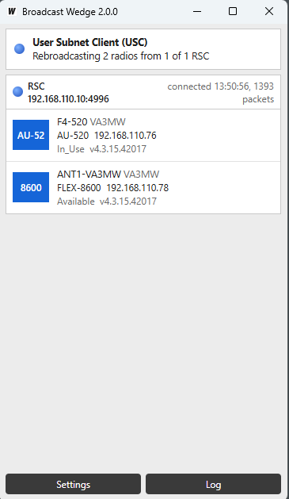

# Broadcast Wedge: Setup Guide

This guide assumes no networking experience. Follow it from top to bottom.

## Read this first

### SmartLink is the best way to operate your radio remotely

FlexRadio's own **SmartLink** is the recommended way to use your radio from
another location. It is built into the radio and SmartSDR, it is supported by
FlexRadio, and it needs no extra software. If SmartLink works for you, use it
and stop reading here.

Broadcast Wedge is only for people who **already have a working VPN** between
their two locations and want SmartSDR to connect through that VPN instead.
If you are using a VPN, this should work. It does not create a VPN for you,
and it cannot fix one that is not working.

### There is no warranty. You are on your own.

This program is free and is provided **"as is", with no warranty of any
kind**. It is **not a FlexRadio product** and FlexRadio does not support it.
Please do not contact FlexRadio support about it.

If it does not work, breaks something, or behaves unexpectedly, the risk is
entirely yours. Nobody is obliged to help you fix it. By using it you accept
that.

## What it does, in plain words

Your radio constantly shouts "I am here!" on your home network. SmartSDR
listens for that shout, and that is how the radio appears in the list when
SmartSDR starts.

That shout cannot travel through a VPN. So when you are somewhere else,
SmartSDR hears nothing and shows an empty list, even though the VPN could
reach the radio perfectly well.

Broadcast Wedge fixes that with two copies of the same program:

- One copy sits **near the radio**, listens for the shout, and passes it down
  the VPN.
- One copy sits **near you**, receives it, and repeats the shout on your
  local network so SmartSDR hears it.

SmartSDR then shows the radio and connects to it through your VPN as usual.

## What you need

1. **A working VPN** between the place where the radio is and the place where
   you are.
2. **A Windows 10 or 11 PC at the radio's location** that is left switched on.
   It must be on the same network as the radio. This guide calls it the
   **radio PC**.
3. **Your own Windows PC** with SmartSDR installed. This guide calls it
   **your PC**.

## Step 1: Check that your VPN can reach the radio

Do this before installing anything. If this step fails, Broadcast Wedge
cannot help, and you need to fix the VPN first.

1. Find your radio's IP address. On the radio PC, start SmartSDR and look at
   the radio in the list; the address looks like `192.168.1.50`. Write it
   down.
2. Go to your PC (at the remote location, with the VPN connected).
3. Click the Start button, type `cmd` and press Enter. A black window opens.
4. Type `ping` followed by a space and the radio's address, then press Enter.
   For example:

   ```
   ping 192.168.1.50
   ```

5. Look at the result:
   - Lines starting with **"Reply from"** mean the VPN can reach the radio.
     Carry on to Step 2.
   - **"Request timed out"** or **"Destination host unreachable"** means the
     VPN cannot reach the radio. Stop here and sort out the VPN (or use
     SmartLink instead).

## Step 2: Download the program

1. Go to <https://github.com/va3mw/FlexRadio-Broadcast-Wedge/releases/latest>
2. Under **Assets**, click **BroadcastWedge.exe** to download it.
3. Put a copy on the radio PC and a copy on your PC. Any folder will do, for
   example the Desktop. There is no installer.

The first time you run it, Windows may show a blue box saying **"Windows
protected your PC"**. Click **More info**, then **Run anyway**. This appears
because the program is not digitally signed.

## Step 3: Set up the radio PC

1. On the radio PC, double-click **BroadcastWedge.exe**.
2. Click **Settings** at the bottom.
3. Under **This PC is on**, choose **the radio subnet (RSC)**.
4. Leave **TCP port** at `4996`.
5. Click **Save**.
6. If Windows asks whether to **allow access** through the firewall, tick
   **Private networks** and click **Allow access**.

Within a few seconds your radio should be listed under **Radios on this
subnet**, with a ticked **Export** box beside it. If you have several radios
and want to keep one private, untick its **Export** box.

Now find the radio PC's own address, which you need for the next step:

1. On the radio PC, click Start, type `cmd` and press Enter.
2. Type `ipconfig` and press Enter.
3. Find the line that says **IPv4 Address**. The number beside it (for
   example `192.168.1.20`) is the radio PC's address. Write it down.

If several IPv4 addresses are listed, you want the one your VPN can reach.
For a VPN that joins two whole networks together (a router-to-router VPN),
that is normally the one that starts with the same numbers as the radio's
address.

**Leave the program running on the radio PC.**

## Step 4: Set up your PC

1. Connect your VPN.
2. On your PC, double-click **BroadcastWedge.exe**.
3. Click **Settings**.
4. Under **This PC is on**, choose **the user subnet (USC)**.
5. In the box labelled **RSC addresses, one per line**, type the radio PC's
   address from Step 3. For example:

   ```
   192.168.1.20
   ```

6. Leave **Broadcast on** set to **All network interfaces**.
7. Click **Save**.

After a few seconds the window should show a blue dot, the word
**connected**, and your radio listed underneath, like this:



## Step 5: Start SmartSDR

Start SmartSDR on your PC. Your radio should now be in the list. Select it
and connect exactly as you would at home.

**Leave Broadcast Wedge running on both PCs** for as long as you want the
radio to appear.

## Using a Raspberry Pi as the radio PC

If you would rather not leave a Windows PC running at the radio's location, a
Raspberry Pi can do the job instead. This needs a Pi running 64-bit Raspberry
Pi OS, connected to the same network as the radio, and a little comfort with
typing commands.

1. On the Pi, download `broadcastwedge_2.1.0_arm64.deb` from
   <https://github.com/va3mw/FlexRadio-Broadcast-Wedge/releases>.
2. Open a terminal in the folder you saved it to and type:

   ```
   sudo apt install ./broadcastwedge_2.1.0_arm64.deb
   ```

3. Find the Pi's address by typing `hostname -I`. The first number shown (for
   example `192.168.1.30`) is the one you want.
4. On any computer on the same network, open a web browser and go to that
   address followed by `:4997`, for example `http://192.168.1.30:4997`.
5. You will see the same screen as the Windows program. Click **Settings**,
   choose **the radio subnet (RSC)** and click **Save**.

From here, carry on at Step 4 above, using the Pi's address as the radio PC's
address. The Pi starts the program by itself every time it is switched on.

Anyone on your network can open that web page and change the settings; it has
no password.

## Each time you use it

1. Make sure the radio PC is on and Broadcast Wedge is running on it.
2. Connect your VPN.
3. Start Broadcast Wedge on your PC.
4. Start SmartSDR.

To have it start by itself when Windows starts: press **Windows key + R**,
type `shell:startup`, press Enter, and drag a shortcut to
**BroadcastWedge.exe** into the folder that opens. It remembers its settings.

## If something is not working

The coloured dot at the top of the window is the quickest clue: **blue**
means working, **amber** means working but no radios yet, **red** means
there is a problem. The **Log** button shows what the program is doing in
more detail.

| What you see | What it means and what to try |
| --- | --- |
| Radio PC shows **No radios heard on this subnet yet** | The radio PC cannot hear the radio. Check the radio is switched on and that the radio PC is on the same network as the radio. If SmartSDR on the radio PC cannot see the radio either, the problem is not this program. |
| Your PC shows a red dot and a message with **timeout** or **refused** | Your PC cannot reach the radio PC. Check the VPN is connected, the address you typed is correct, and Broadcast Wedge is running on the radio PC. Then see "Opening the firewall" below. |
| Your PC shows **not a Broadcast Wedge RSC** | The address you typed belongs to something else. Recheck the radio PC's address. |
| Your PC shows **connected** but **the RSC is not exporting any radios** | The radio PC is reachable but has no radios to offer. Look at the radio PC: is the radio listed, and is **Export** ticked? |
| The radio is listed in Broadcast Wedge but **not in SmartSDR** | Close and restart SmartSDR. If it still does not appear, open **Settings**, change **Broadcast on** from **All network interfaces** to the entry for your normal network, and click **Save**. |
| The radio appears in SmartSDR but **will not connect**, or connects with no display or audio | The VPN is blocking traffic between your PC and the radio. Repeat Step 1. This is a VPN problem that Broadcast Wedge cannot fix; SmartLink is the alternative. |

### Opening the firewall on the radio PC

If Windows never asked to allow access in Step 3, or you clicked Cancel, do
this once on the radio PC:

1. Click Start, type `Windows Defender Firewall with Advanced Security` and
   open it.
2. Click **Inbound Rules** on the left, then **New Rule...** on the right.
3. Choose **Port** and click Next.
4. Choose **TCP**, type `4996` beside **Specific local ports**, and click
   Next.
5. Choose **Allow the connection** and click Next.
6. Leave all three boxes ticked and click Next.
7. Name it `Broadcast Wedge` and click Finish.

## Removing it

Close the program and delete **BroadcastWedge.exe**. To remove its settings
and logs as well, press **Windows key + R**, type `%AppData%`, press Enter,
and delete the **BroadcastWedge** folder. If you added a firewall rule or a
startup shortcut, delete those too.

## One more time

SmartLink is the supported way to do this. Broadcast Wedge is an unsupported
tool with no warranty, offered in case it is useful to people who run their
own VPN. You use it entirely at your own risk.
